#  Google Play Services

### LEARNING OBJECTIVES
*After this lesson, you will be able to:*
- Describe what features Google Play Services offers
- Set up and use the Analytics API

### STUDENT PRE-WORK
*Before this lesson, you should already be able to:*
- Make APIs calls

---

### LESSON GUIDE

| TIMING  | TYPE  | TOPIC  |
|:-:|---|---|
| 5 min  | [Opening](#opening-5-mins)  | Discuss lesson objectives |
| 15 min  | [Introduction](#introduction-what-are-google-play-services-15-mins)  | What are Google Play Services |
| 5 min  | [Demo](#demo-google-apis-reference-5-mins)  | Google APIs Reference |
| 10 min  | [Guided Practice](#guided-practice-setting-up-your-app-10-mins)  | Setting up your app |
| 30 min  | [Guided Practice](#guided-practice-implementing-the-analytics-api-30-mins)  | Implementing the Analytics API |
| 20 min  | [Independent Practice](#independent-practice-topic-20-mins)  | Topic |
| 5 min  | [Conclusion](#conclusion-5-mins)  | Review / Recap |
<a name="opening"></a>
## Opening (5 mins)

Up until this point, we haven't really differentiated between Android, the open-source operating system, and the version of Android offered by Google. When you use a device certified by Google (the vast majority of phones and tablets you come across), you gain the ability to use many special services offered by Google. Today, we will be learning about some of them, and how to actually use them.

> Check: Think of some specific features they think Google might offer that don't come standard with Android.

***

<a name="introduction"></a>
## Introduction: What are Google Play Services (15 mins)

Google Play Services was first introduced in 2012 to allow new authentication abilities and easier ways to access Google Plus. Since then, it has expanded to include many cool features used by all kinds of apps. These include things like location, Sign In, Drive, Cast, Ads, Wallet, and Fit.

Some devices choose not to use Play Services, such as the Fire line by Amazon. They run a heavily customized version of Android without access to the Play Store or any Play Services.

> Check: Predict, with a partner, the benefits of something like this.

Any device running Android 2.3 or newer has access to Play Services, and it automatically updates from the Play Store. Previously, new features were primarily rolled out through updates to Android, but with device manufacturers and service providers causing long delays, Play Services allows Google to quickly update all compatible devices.

Google updates Google Play Services often with some very cool features. Let's take a look at a [Youtube video](https://www.youtube.com/watch?v=nZjY_DPO1qs).

Keep an eye on the Google Developers YouTube channel for new updates about new features from Google.

> Check: What advantages does Google Play Services offer both users and developers? What are some disadvantages?

***

<a name="demo"></a>
## Demo: Google APIs Reference (5 mins)

Before we get started on actually using Google Play Services, [let's take a look at the available services](https://developers.google.com/android/guides/setup). This is a list of all the
Google Play Services we can import into our project.

***

<a name="demo"></a>
## Guided Practice: Setting up your app (10 mins)

We need to complete a few steps to prepare our app to use Google Play Services.

First, we need to check if we have the correct files downloaded in the SDK Manager. Open the SDK Manager, go to the SDK Tools tab, then make sure Google Play Services is checked.

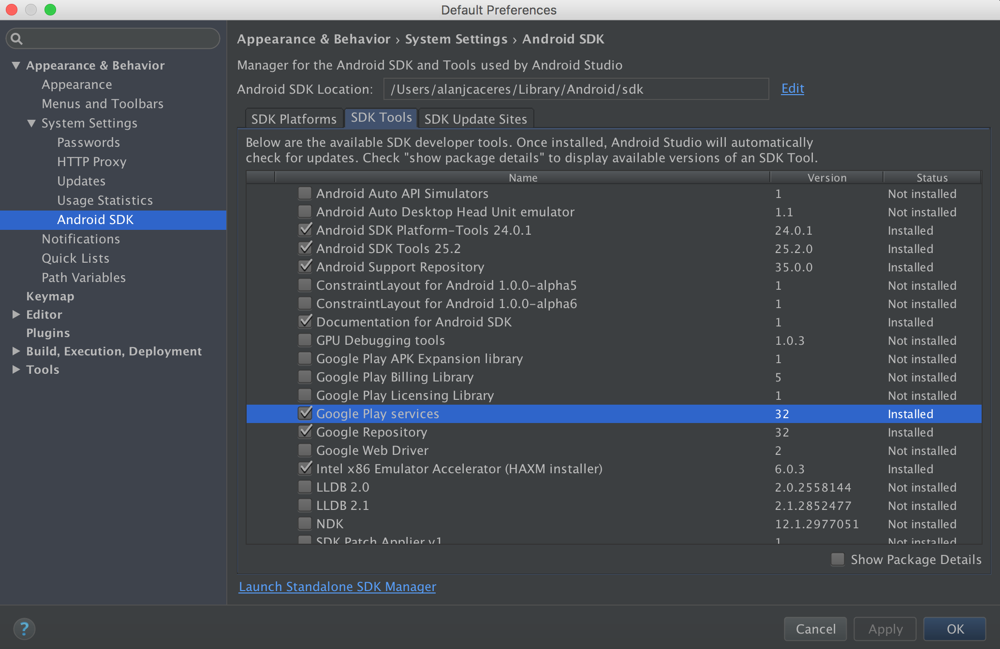

Next, if you use an emulator, make sure you chose an image that includes Google Play Services.

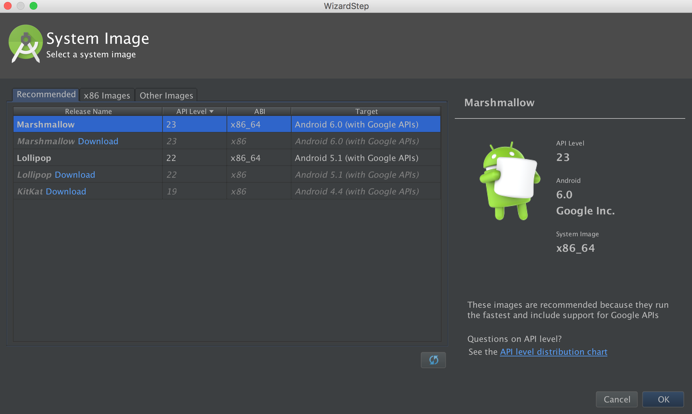

***

<a name="guided-practice"></a>
## Guided Practice: Implementing the Analytics API (30 mins)

We are going to implement Google Analytics into an app.
First things first; we need to set up Google Analytics for Android.
1. [Enable Google services for your app](https://developers.google.com/mobile/add) (You can click me)  
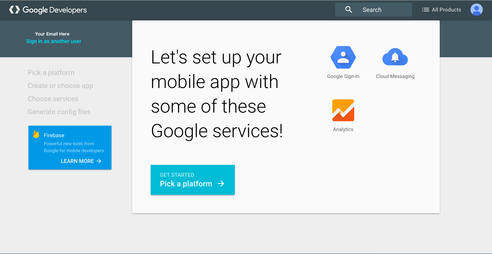

2. Pick your platform  
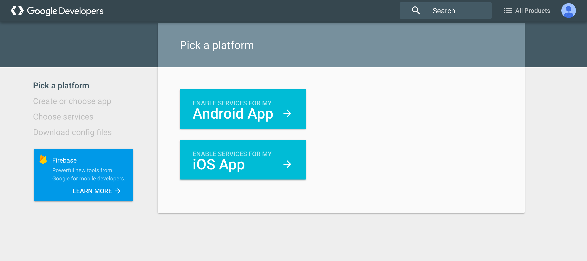

3. Create your app  
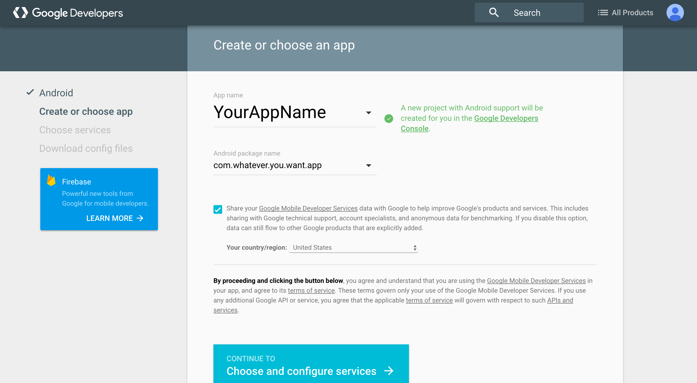

4. Select your service (Analytics)  
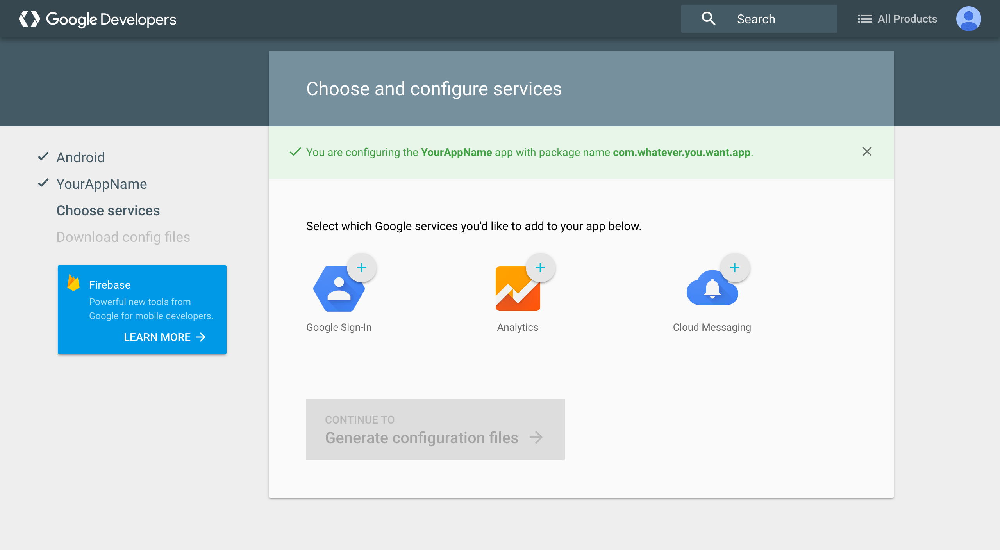

5. Create Analytics account and enable analytics service  
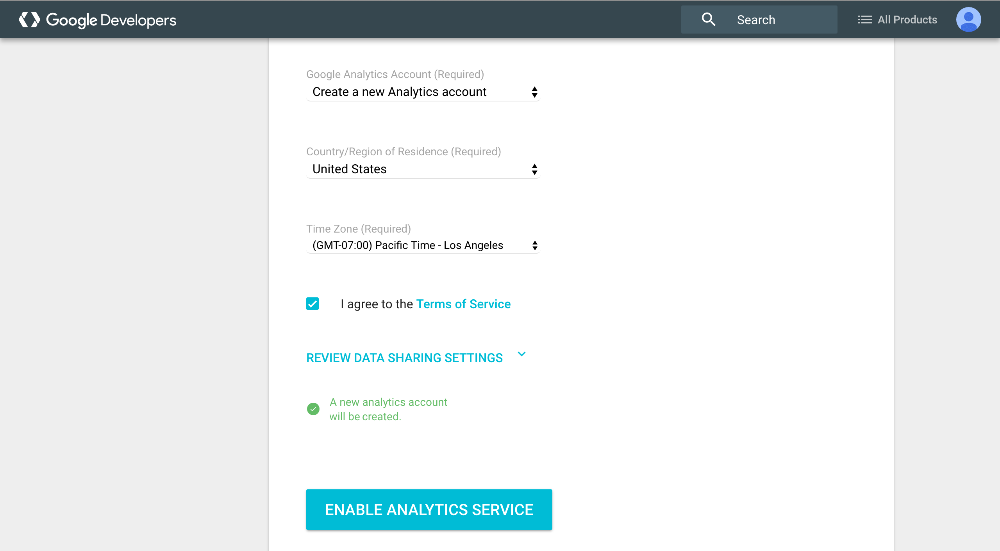

6.Take note of your tracking ID and generate configuration files  
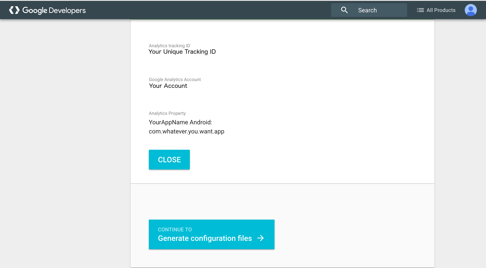

---
Now we need to implement Google Analytics in our app. There are a few ways to do this.

You could add the library to your app's `gradle` dependencies block with
`compile com.google.android.gms:play-services-analytics:9.4.0` and implement everything your self.

### OR

You could have Android Studio do all of that for you.

#### Let's have Android Studio worry about all the implementation stuff.

Open a new project in Android Studio.

Once open, in the menu bar, go to `File` -> `Project Structure`. Once in the `Project Structure` window click on Analytics.
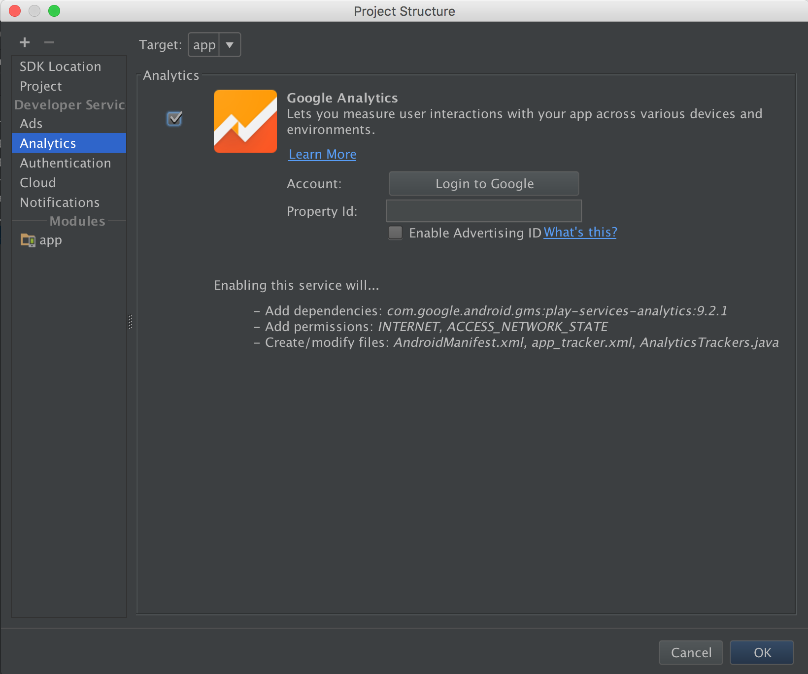</p>

Now, click Login to Google. You will be taken to the browser in order to authorize Android Studio to link to your account.
**Make sure you log in with the account you used to create the Google Analytics account**
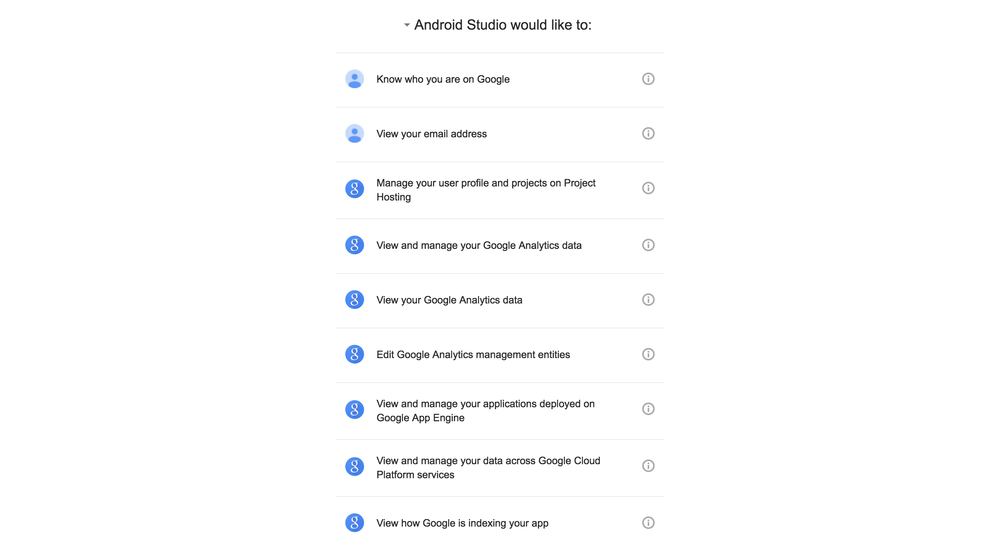</p>

Once you authorize Android Studio to link to your account go back to Android Studio and you should see the `Project Structure` window populate your account.
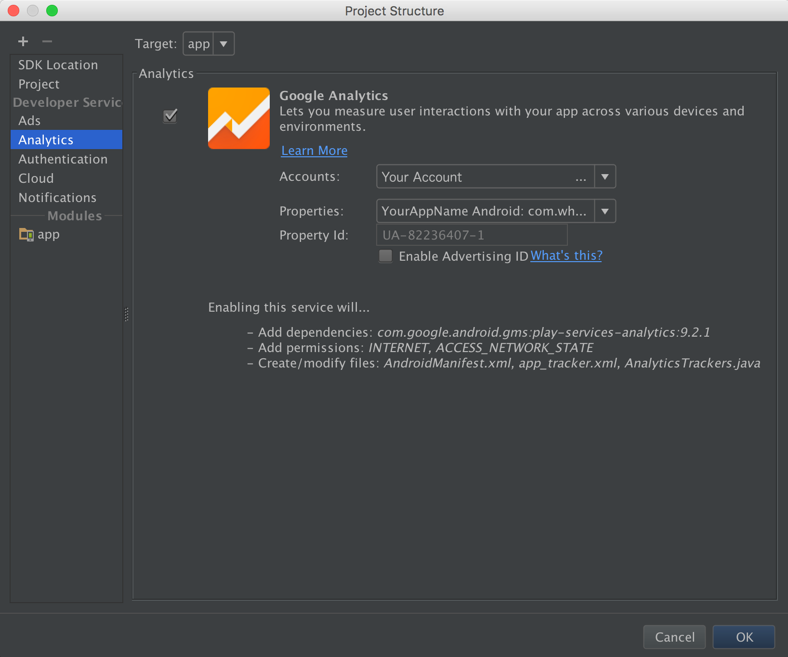</p>

Click OK and Android Studio will automatically create what you need for Google Analytics.

You will now see an `AnalyticsTracker` class in you project's hierarchy.

> Note: Take a few minutes to look at what's inside the `AnalyticsTracker` class

Now we need to create an `AnalyticsApplication` class to initialize our AnalyticsTracker and add it to our `AndroidManifest.xml`


```xml
<application
android:name=".AnalyticsApplication"
...
>
...
</application>
```

In our `AnalyticsApplication` class, add this ***inside*** the `onCreate()` method

```java
AnalyticsTracker.initialize(this);
```

Let's also create a helper method to help us get the tracker provided by Google.

```java
public static Tracker getDefaultTracker(){
  return AnalyticsTrackers.getInstance()
                .get(AnalyticsTrackers.Target.APP);
}
```
This will allow us to easily get the tracker linked to our account anywhere in our project.

Launch the app, and go to the Analytics page at analytics.google.com. Look under the real-time tracking and you should see your screen!

> Check: Were you able to successfully solve the problem or complete the task?

***

<a name="ind-practice"></a>
## Independent Practice: Topic (25 mins)

Now that you know how to track what screen a user is seeing, you will try tracking user actions in your app. Review the link below on Event Tracking. Add at least 3 different UI Widgets and track some action for each of them. Confirm that they are showing up in your analytics tracker!

[Event Tracking](https://developers.google.com/analytics/devguides/collection/android/v4/events)

> Check: Were you able to create the desired deliverable(s)? Did it meet all necessary requirements / constraints?

***

<a name="conclusion"></a>
## Conclusion (5 mins)

The Google Play Services API have grown to encompass a very large set of features, and they can be difficult to navigate around sometimes, but once you get used to them, they are extremely helpful. With their assistance, you are able to add some extremely powerful capabilities with relatively little effort.

***

### ADDITIONAL RESOURCES
- [Google Play Services](https://developers.google.com/android/guides/overview)
- [Google Play Services Gradle Import List](https://developers.google.com/android/guides/setup)
- [Adding Google Services to your app](https://developers.google.com/mobile/add)
- [Event Tracking](https://developers.google.com/analytics/devguides/collection/android/v4/events)
